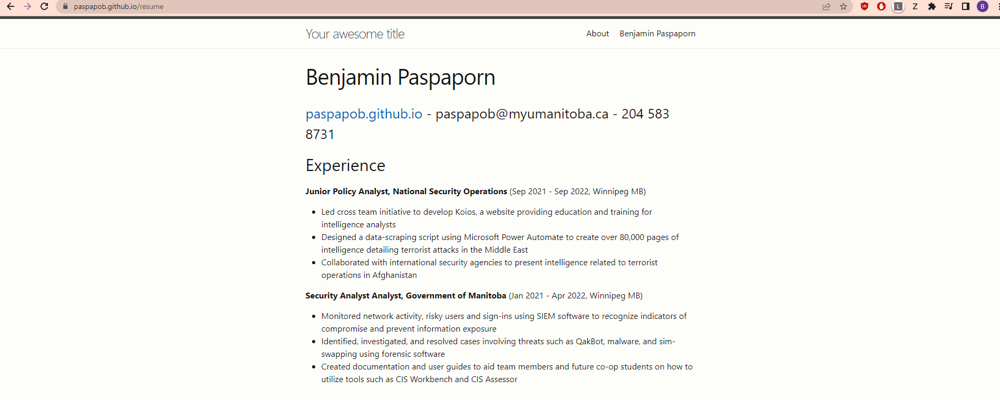
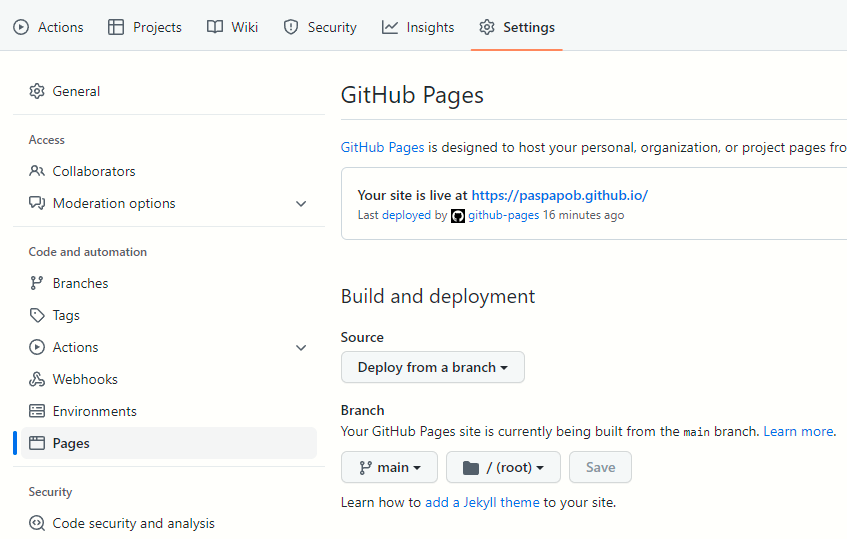

# Hosting a Markdown resume with GitHub Pages and Jekyll on Windows



## 👋 Introduction and Purpose

This documentation provides the instructions and tools necessary to host a
Markdown formatted resume on Windows using **Markdown, Atom, GitHub Pages,
and Jekyll.** Additionally, Etter's principles of technical writing are
detailed alongside each step to demonstrate understanding of his writing
process.

### Software stack explanation
Markdown
- Markdown is a lightweight markup language that is used to format
plaintext documents.
- Markdown will be used to format plain text into a readable resume.

Atom
- A free and open-source text editor, which can be used to edit Markdown files.

GitHub Pages
- Static site hosting service that turns GitHub repositories into websites.
- This will be used to host a Markdown formatted resume.

Jekyll
- A static site generator which will be used to convert plain text files into a
static website.
- Jekyll is necessary to generate the site that will be hosted by GitHub Pages.

### *Why should someone host a website and a Markdown resume?*
Having a personal website is a great way to connect with others. Hosting a
website with GitHub Pages creates an accessible avenue for others to view content.
This can include resumes, projects, portfolios, media, and much more.
Hosting a resume in Markdown allows users to view your resume from different
platforms and devices. For example, Markdown can be created and viewed using
the most common (and uncommon) operating systems. Moreover, technological
advancements will not impede the utility of Markdown as it can be read using
a simple text editor. This results in a document that can be hosted and shared
indefinitely without concern for incompatibility.


## ✏️ Getting started

To get started, the following tools must be installed/setup.

### Markdown
Prepare and complete a Markdown formatted resume. Markdown files can be created
and edited using Atom. This resume will be hosted on the completed site.
Information regarding Markdown formatting and a sample resume
can be found below under ["More Resources".](https://github.com/paspapob/paspapob.github.io/#more-resources)

### GitHub
As the hosted resume will be hosted using GitHub Pages, it is necessary to own
a GitHub account. Users can register for GitHub by visiting the following
link: https://github.com/join

### GitHub Desktop
GitHub Desktop is software that implements the features of Git through a GUI
as opposed to a shell. GitHub Desktop will be used to work with repositories.

GitHub Desktop can be downloaded and installed at: https://desktop.github.com/

### Jekyll
Jekyll is based on **Ruby**. Consequently, Ruby must be installed as a
prerequisite before installing Jekyll. Jekyll will be used to generate the files
necessary to setup a static site.

Instructions on how to install Ruby and Jekyll on Windows can be found on the
official Jekyll website at https://jekyllrb.com/docs/installation/windows/


## 🛠 Installation


### *Step 1: Create a GitHub Repository*
```
With the "Getting started" section placed before Step 1, the reader should now
know what materials and tools they need to proceed. Also, the
information given is only what the audience needs to know. There are no
unnecessary details as Etter emphasizes that documentation should write what
the audience needs to know, and nothing more.
```

A GitHub repository will be used to contain the files necessary to host
the website.

Proceed by opening https://Github.com and log in with your created account.

1. Click the + drop-down menu in the upper right corner of the page
2. Click **New repository** in the drop down menu.
2. Enter `USERNAME.github.io` into the "Repository name" input box, such that
**USERNAME** is the username associated with the GitHub account.
3. Click **"Create Repository"** located at the bottom of the page.

>❗️
>From Step 2 onwards, **"USERNAME"** will be used as a place holder for the username
associated with the created GitHub Account

```
The note implemented above is an aspect of avoiding
unnecessary information and repetition. The note is used as context for future
tasks to reduce the need for repetitive details.
```


### *Step 2: Clone a repository for local use*
```
Step 2 adheres to Etter's rule of avoiding comprehensive writing unless it is
absolutely necessary. In the tasks below, the context provided is only that of
what is needed. For example, the description of Step 2 states that the user
needs to sign into GitHub Desktop. There is no additional information detailing
GitHub Desktop as it is unnecessary for this step.
```

A local version of the repository is needed to generate a static site using
Jekyll. Before proceeding, open GitHub Desktop and sign in.


1. Click **"Set up in Desktop"** in the Quick setup section of the repository page.
2. Provide an appropriate local path for the repository.
3. Click **"Clone"**.


### *Step 3: Generate and setup a static site using Jekyll*
```
In Step 3, there are multiple tasks that involve shell commands. Etter
recommends that instead of writing from memory, it is better to copy and paste
the commands after validating that they work. This is in contrast to
broadly explaining what kind of shell command should be used.
In the tasks provided, shell commands can be directly copied and pasted
from the instructions into the Command Prompt. Further, the commands
provided have been successfully tested (as recommended by Etter).
```

Following Step 2, Jekyll can now be utilized to generate the files necessary
for a static site. Before proceeding, note the latest supported version of
github-pages. This information can be found at the following
link: https://pages.github.com/versions/

1. Open Command Prompt.
2. Change directory to the cloned repository.
3. Run the command `jekyll new --skip-bundle .`
4. Open the newly generated Gemfile with Atom.
5. Add `#` to the beginning of the line that starts with `gem "jekyll"`
6. Replace the line starting with `# gem "github-pages"` with the
following line:
<br> `gem "github-pages", "~> GITHUB-PAGES-VERSION", group: :jekyll_plugins`
such that **GITHUB-PAGES-VERSION** is the latest supported version of
github-pages.
7. Save the Gemfile.
8. Run the command `bundle install` from the Command Prompt.
9. Provide a summary in Github Desktop.
10. Click **"Commit to main"**
11. Click **"Publish branch"**
12. Confirm the site has been generated by opening
`USERNAME.github.io` in the browser.


### *Step 4: Host the Markdown Resume*
```
Etter states that consistency is important as it makes writing appear more
approachable and easier to scan. The concept of consistency is implemented by
ensuring that each step is identical in composition. Each step has a short
description, followed by a list of tasks. Additionally, important commands and
details are formatted with elements such as bolding or code blocks.
```

With the necessary files now generated, it is possible to host the Markdown
formatted resume.

1. Open the completed Markdown resume in Atom.
2. Add the following code to the top of the file.
<br>  `---` <br>
`layout: page` <br>
`title: "Your Title"` <br>
`---`
3. Rename the Markdown resume file to "index.md".
4. Replace the index.markdown file in the repository directory with the renamed
Markdown resume file.
5. Provide a summary in Github Desktop.
6. Click **"Commit to main"**.
7. Click **"Push origin"**.
8. Confirm the Markdown formatted resume has been hosted
by opening `USERNAME.github.io` in the browser

### *More Resources*

[Markdown Tutorial](https://www.markdowntutorial.com/)
- Interactive tutorial for learning how to format text in Markdown

[Modern Technical Writing: An Introduction to Software Documentation](https://www.amazon.ca/Modern-Technical-Writing-Introduction-Documentation-ebook/dp/B01A2QL9SS)
- Excellent resource for learning how to create software documentation

[Awesome README](https://github.com/matiassingers/awesome-readme)
- GitHub hosted resource containing a curated list of high quality READMEs

[Sample Resume from Mikepqr](https://github.com/mikepqr/resume.md)
- Example of a Markdown formatted resume

## Authors and Acknowledgements
Lu, Junyi - LUJ8 <br>
Kolton, Zac - KOLTONZ <br>
Paspaporn, Benjamin - PASPAPOB <br>
Murray, Evan - MURRAYE2


## FAQs


### Why is Markdown better than a word processor?

As previously stated in the introduction, Markdown is easy to use and has a
small barrier to entry. Firstly, Markdown files can be made from any text editor
and can be utilized by users without a technical background. Secondly, Markdown
is incredibly versatile. Markdown can be read as plain text, and is
compatible with virtually all platforms and operating systems. In comparison to
Microsoft Word, Markdown does not require the use of a GUI to implement
elements such as headers, lists, tables, and more. Further, it can be easily
exported as a PDF, EPUB, HTML as Markdown is essentially plain text.

### Why is Windows not recognizing the "jekyll" command?

It is important to remember that following the completion of the Ruby
installation, users must open a new Command Prompt and install Jekyll by
running `gem install jekyll bundler`. Following this command, users can confirm
installation by running `jekyll -v`

### Why has the site not been generated after Step 3?

Note that the newly generated site may open to a 404 page upon completion of
Step 3. If this occurs, proceed to the Settings page of the repository.
Within the Pages section under Code and automation, ensure that GitHub Pages
is enabled and is being built from "main".
Please allow time for the site to be built and deployed before continuing to
Step 4.



### Why am I not seeing changes after pushing origin?

Changes may not be immediately reflected after pushing using GitHub Desktop.
Allow time for GitHub to build and deploy the new changes, then reload the
site to confirm the changes.
